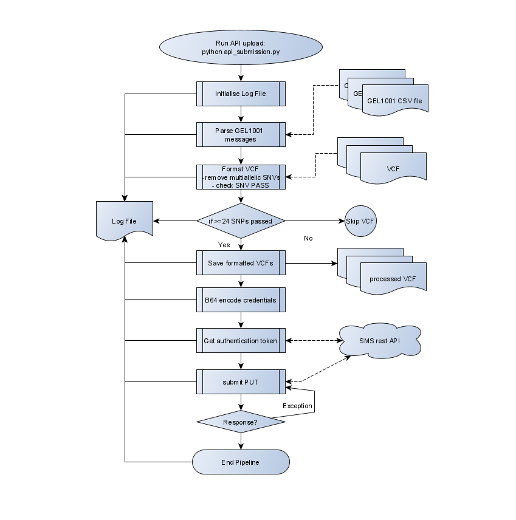

# WGS PENGALLY SNPS using Nimagen RC-PCR kit on MiSeq
This project includes a script to parse GEL1001 csv messages and submit vcf payloads to the GEL WGS SMS service

python api_submission.py <path/to/VCFs> <GEL1001.csv> <GEL1001.csv> ...

*api_submission.py*
1) takes 1 or more GEL1001 csv file(s) as sample numbers are likely to be low at the beginning of service cases that need submission are likely to be spread over multiple worklists
2) requires a genotype directory with GATK filtered VCFs.
3) VCF files are parsed into payload text - removing non PASS SNPs / multiallelic loci / contigs (from the header)
4) parsed VCFs are saved in a central backup location to keep a reference of exact payload sent to the GEL SMS
5) Stringent logging of all processes stored in central backup location
6) Stringent error reporting to STDOUT as well as logs.

